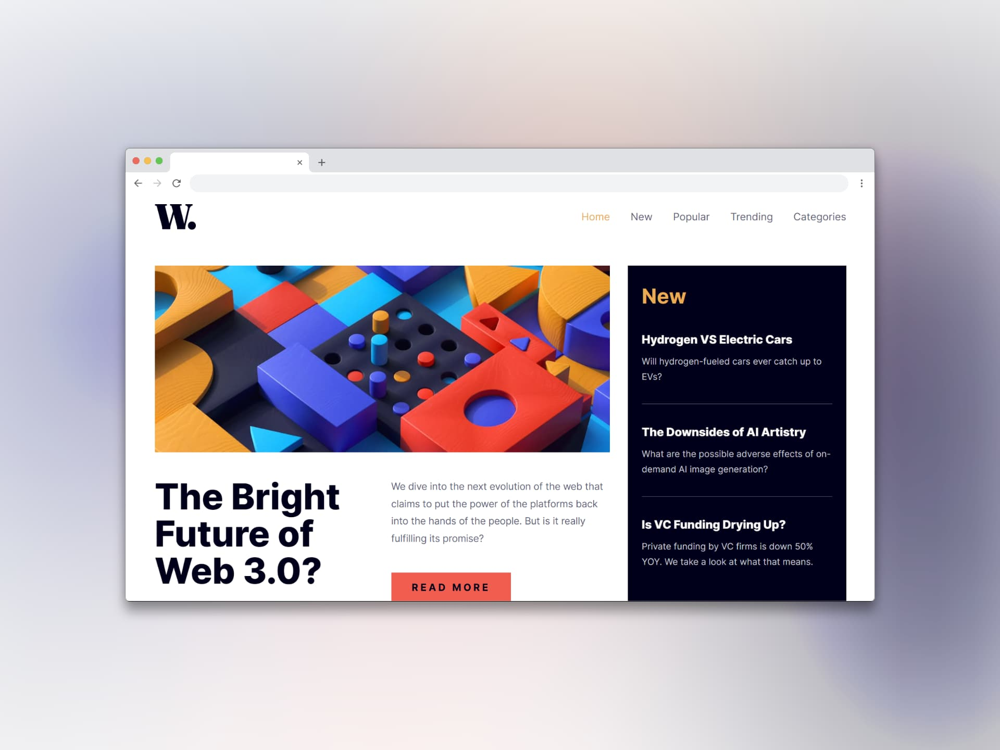

# Página de inicio de noticias (News homepage)

## Tecnologías usadas

- HTML
- Tailwind CSS
- JavaScript
- Astro
- Preact

[Ver app🔗](https://seandsun.github.io/monorepo-zero-astro/01-news-homepage/)

  Challenge by <a href="https://www.frontendmentor.io?ref=challenge" target="_blank">Frontend Mentor</a>. 
  Coded by <a href="https://github.com/seandsun">Seandsun</a>.

 <h3 align="center">< seandsun /></h3>